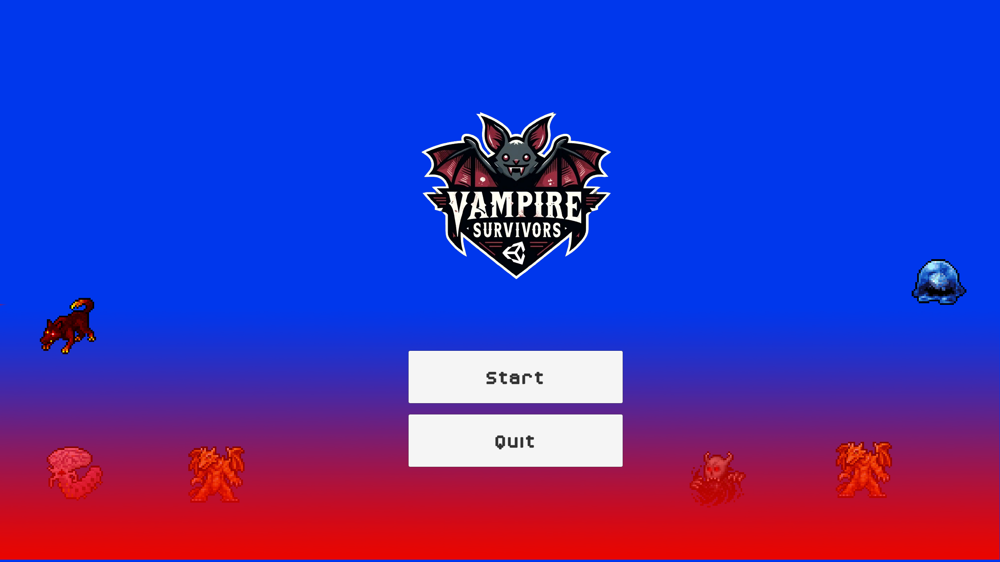
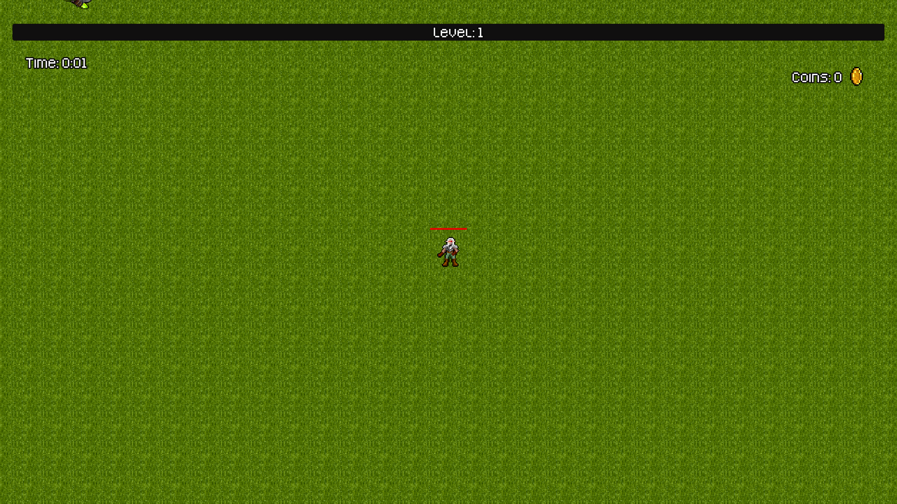
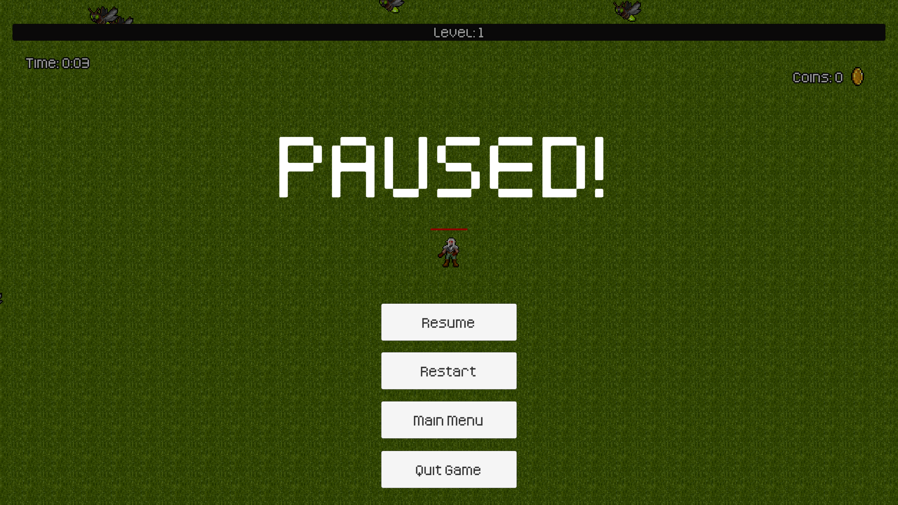

# Vampire Survivors



"Vampire Survivors" is a 2D survival arcade game built with Unity, where players must endure waves of supernatural enemies. In this action-packed game, players choose a character with unique abilities to survive against relentless hordes of vampires and other monstrous creatures.

## Table of Contents

- [Getting Started](#getting-started)
  - [Prerequisites](#prerequisites)
  - [Installation](#installation)
- [Playing the Game](#playing-the-game)
  - [Controls](#controls)
  - [Gameplay Overview](#gameplay-overview)
- [Development](#development)
  - [Project Structure](#project-structure)
- [License](#license)
- [Contact](#contact)

## Getting Started

These instructions will get you a copy of the project up and running on your local machine for development and testing purposes.

### Prerequisites

What things you need to install the software and how to install them:

```bash
Unity Editor (2021.3 LTS or newer)
Git
```

### Installation

A step-by-step series of examples that tell you how to get a development environment running:

1. Clone the repository:
   ```bash
   git clone https://github.com/VampAK1864/vampire-survivors.git
   ```
2. Open Unity Hub and add the cloned repository folder.
3. Select the correct Unity version and open the project.

## Playing the Game

### Controls

- **Arrow Keys:** Move the character
- **Mouse:** Choose your upgrade at each level up.

### Gameplay Overview

Survive as long as possible by avoiding and defeating waves of enemies. Collect power-ups to enhance your character's abilities. Each game session lasts until your character's health depletes.



## Development

### Project Structure

The project follows this structure to ensure ease of navigation and development:

- **Assets/**
  - **Animations/**: Contains all in-game animations.
  - **Prefabs/**: Main enemy objects made.
  - **Scenes/**: Unity scenes including the main game and menus.
  - **Scripts/**: Game logic scripts.



## License

This project is licensed under the MIT License - see the [LICENSE.md](LICENSE) file for details.

## Contact

- **Developers:** Antonis Kyriakou, George Constantinou and Dimitris Achilleos
- **Project Link:** https://github.com/VampAK1864/vampire-survivors
